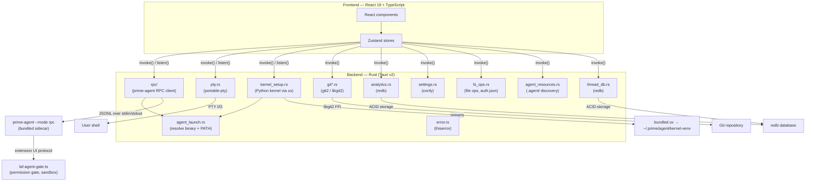
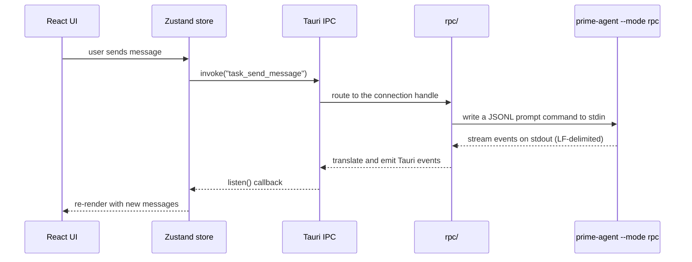

# Architecture

## System overview

LAF Agent is a native desktop client for the prime-agent coding agent. The app is built with Tauri v2: a Rust backend manages the agent subprocess, git operations, file system access, terminal emulation, local analytics, and config persistence, while a React 19 frontend provides the UI. All communication between the two layers happens through Tauri's IPC (`invoke()` for commands, `listen()` for events). There are no Node.js APIs in the frontend.

The agent itself runs as a child process speaking prime-agent's RPC protocol — newline-delimited JSON over stdin/stdout. It ships inside the app bundle; see [sidecar-architecture.md](sidecar-architecture.md).

## Data flow

A typical user interaction follows this path: the React UI dispatches an action to a Zustand store, which calls a Tauri `invoke()` command. The Rust backend processes the command and, for streaming operations like a chat turn, emits events back to the frontend via `listen()` callbacks that update the store.

## Backend modules

All Rust modules live in `src-tauri/src/commands/`. Tauri commands return
`Result<T, AppError>`, except the `rpc/` module, where errors arrive from the
agent as JSON strings and are surfaced as `Result<T, String>`.

### Agent

| Module | Purpose |
|--------|---------|
| `rpc/` | prime-agent RPC client. Spawns `prime-agent --mode rpc`, writes JSONL commands to stdin, and translates the agent's stdout events into Tauri events. `commands.rs` holds the handlers (including the generic `agent_rpc_request` bridge), `connection.rs` the process lifecycle and event translation, `types.rs` the shared state. |
| `agent_launch.rs` | Resolves how to launch the agent — user-configured path, then the bundled sidecar, then PATH — and builds the PATH every spawn site must use so the bundled `uv` wins. |
| `kernel_setup.rs` | Provisions the agent's Python kernel with the bundled `uv`, streaming progress lines to the onboarding UI. |
| `provider_discovery.rs` | Probes a provider's `/models` endpoint to validate a key and list what it unlocks. |

### Core modules

| Module | Purpose |
|--------|---------|
| `git.rs` | Git operations via `git2` (libgit2 bindings). Branch, stage, commit, push, pull, fetch, worktree management. |
| `git_ai.rs` | Commit message generation. Runs the agent one-shot (`--print --no-tools --no-session`) outside the user's thread. |
| `git_history.rs` | Git log and history traversal. |
| `git_pr.rs` | Pull request creation and management. |
| `git_stack.rs` | Stacked branch workflows. |
| `git_utils.rs` | Shared git utility functions. |
| `pty.rs` | Terminal emulation via `portable-pty`. Manages PTY child process lifecycle. |
| `settings.rs` | Config persistence via `confy`, plus the recent-projects list. |
| `fs_ops.rs` | File operations, agent detection, and `~/.prime/agent/auth.json` management. |
| `agent_resources.rs` | `.agent/` project configuration discovery and parsing. |
| `error.rs` | Shared `AppError` enum via `thiserror`. |

### Data and persistence

| Module | Purpose |
|--------|---------|
| `analytics.rs` | Local usage statistics in `redb`. Coding hours, messages, tokens, tool calls, diff stats, model usage. Nothing leaves the machine. |
| `thread_db.rs` | Thread and conversation persistence via `redb`. |
| `checkpoint.rs` | Conversation checkpoint management for `/btw` and turn rollback. |

### Text generation and processing

| Module | Purpose |
|--------|---------|
| `branch_ai.rs` | Branch name generation from the first message. |
| `thread_title.rs` | Thread title generation from the first message. |
| `pr_ai.rs` | PR title and body generation from a branch diff. |
| `diff_parse.rs` | Unified diff parsing and rendering. |
| `diff_stats.rs` | Line-level statistics annotated onto tool-call diff payloads. |
| `markdown.rs` | Server-side markdown parsing for assistant messages. |

### Infrastructure

| Module | Purpose |
|--------|---------|
| `project_watcher.rs` | Real-time filesystem watching for the file tree panel. |
| `resource_watcher.rs` | Watches the `.agent/` directory for config changes. |
| `vcs_status.rs` | Git status indicators per file (modified, added, deleted, renamed). |
| `fuzzy.rs` | Fuzzy search for the command palette and pickers. |
| `tracing.rs` | Application-level tracing and debug logging. |
| `process_diagnostics.rs` | Process health monitoring and diagnostics. |
| `serde_utils.rs` | Shared serialization utilities. |

> Every module here is declared in `commands/mod.rs` and every command is
> registered in `lib.rs`. A module that is missing from `mod.rs` does not
> compile at all, and an `ipc.ts` wrapper whose command is unregistered fails
> only at runtime — five orphaned modules and seven dead wrappers accumulated
> that way before. Keep both lists in sync.

## Frontend architecture

### Stores

Zustand stores in `src/renderer/stores/` are the single source of truth. No Redux, no React Context for global state.

| Store | Responsibility |
|-------|---------------|
| `taskStore.ts` | Tasks, messages, streaming state, agent connection lifecycle, split view |
| `settingsStore.ts` | Agent profiles, model selection, appearance preferences |
| `resourceStore.ts` | `.agent/` config state (agents, skills, steering, MCP servers) |
| `diffStore.ts` | Diff viewer file selection and content |
| `debugStore.ts` | Debug panel log entries and filters |
| `updateStore.ts` | App update checking and installation state |
| `jsDebugStore.ts` | JS console capture for debug panel |
| `fileTreeStore.ts` | File tree panel state, expansion, and filesystem data |
| `filePreviewStore.ts` | File preview modal state |
| `analyticsStore.ts` | Analytics dashboard data and chart state |
| `goalStore.ts` | Goal mode state (objective, iterations, budget, corrections) |
| `vcsStatusStore.ts` | Per-file git status indicators |

### Components

Components live in `src/renderer/components/`, organized by feature:

| Directory | Contents |
|-----------|----------|
| `ui/` | Radix UI primitives styled with `class-variance-authority`, composed via `cn()` helper |
| `chat/` | ChatPanel, MessageList, ChatInput, SplitChatLayout, slash command panels |
| `sidebar/` | TaskSidebar, ResourcePanel, ThreadItem, ProjectItem |
| `code/` | CodePanel, DiffViewer (Shiki for syntax highlighting) |
| `analytics/` | Analytics dashboard with nine chart types (Recharts) |
| `file-tree/` | FileTreePanel, TreeContextMenu |
| `settings/` | SettingsPanel with multiple tabs |
| `diff/` | DiffPanel |
| `debug/` | DebugPanel |
| `dashboard/` | Dashboard, TaskCard |
| `task/` | NewProjectSheet |
| `unified-title-bar/` | Cross-platform title bar |
| `icons/` | Custom icon components |

### Key standalone components

- `CommandPalette.tsx` — `Cmd+K` quick navigation with frecency ranking
- `CommitDialog.tsx` — Git commit with AI message generation
- `Onboarding.tsx` — First-run setup wizard
- `ErrorBoundary.tsx` — React error boundary with recovery
- `PublishRepoDialog.tsx` — Repository publishing workflow
- `CloneRepoDialog.tsx` — Repository cloning
- `WhatsNewDialog.tsx` — Release notes display
- `UpdateAvailableDialog.tsx` — App update prompt

### Hooks

- `useSlashAction` — Client-side slash command dispatcher. Returns whether it handled the input, so the caller knows whether to forward it to the agent as a prompt.
- `useKeyboardShortcuts` — Global keyboard shortcut registration
- `useAttachments` — File and image attachment handling

### IPC layer

`src/renderer/lib/ipc.ts` wraps Tauri's `invoke()` and `listen()` APIs. All frontend-to-backend communication goes through this module. Event listeners from `listen()` must return their unlisten function in `useEffect` cleanup to prevent memory leaks and duplicate handlers.

### Path aliases

`@/*` maps to `./src/renderer/*`, configured in both `tsconfig.json` and `vite.config.ts`.

## Concurrency model

### Process-per-thread over stdio

Each chat thread owns a `prime-agent --mode rpc` child process. The protocol is
newline-delimited JSON on stdin/stdout with an `id` field correlating requests
to responses, which imposes no `Send` constraints — so the client is plain
`tokio::spawn` on the multi-threaded runtime, with one task writing commands and
one reading lines.

> An earlier backend spoke the Agent Client Protocol through a Rust SDK whose
> futures were `!Send`, which forced a dedicated OS thread and a `LocalSet` per
> connection. That is gone. If you find yourself reaching for `LocalSet` here,
> check whether the constraint is real first.

### mpsc channels

Each connection has an `mpsc::UnboundedSender`. Tauri command handlers push
`AgentCommand` variants (send message, cancel, kill, generic RPC request) onto
it, and the connection's event loop writes them to the child's stdin.

### Permission oneshot channels

Permission approval rides prime-agent's extension UI protocol rather than a
dedicated RPC method. The bundled gate extension
(`src-tauri/resources/laf-agent-gate.ts`) intercepts tool calls and raises a
`select` dialog, which arrives as an `extension_ui_request` line. The connection
creates a `oneshot::channel`, stores the sender in the managed `AgentState`, and
emits a permission event. When the user answers, `task_allow_permission` /
`task_deny_permission` look the sender up via `app.try_state::<AgentState>()` —
the managed instance, never a clone — and the connection writes an
`extension_ui_response` line back.

### Generic RPC bridge

`agent_rpc_request(task_id, command, params)` sends any prime-agent RPC method
with a `ui-<uuid>` correlation id, parks a `oneshot` receiver in a pending map,
and resolves it when the matching response line arrives (120-second timeout).
This is why most agent features need no new Tauri command.

### Window cleanup

Tauri's `on_window_event` with `CloseRequested` drains all agent connections
(sending `AgentCommand::Kill` to each) and clears PTY state. An ack-based flush
protocol persists frontend state before shutdown: Rust emits
`app://flush-before-quit`, the frontend flushes and emits `app://flush-ack`,
Rust waits with a two-second timeout.

## State management patterns

### Zustand selector discipline

Always use selectors (`useStore(s => s.field)`) instead of `useStore()` to prevent full-store re-renders. For multiple fields, use `shallow` equality. For derived state, use `useMemo` over computing in render.

### Bail-out guards

Every setter checks if the value changed before calling `set()`. Without this, every agent event triggers a React re-render even when nothing changed. Multi-field updates use a single `setState` callback instead of multiple `getState()` + `set()` calls to avoid stale reads.

### rAF batching for high-frequency events

Debug log entries and streaming chunks arrive at hundreds per second. These are buffered and flushed once per `requestAnimationFrame` using `concat + slice` instead of per-entry array copies.

### Streaming isolation

A `StreamingMessageList` child component owns the four streaming selectors (`streamingChunk`, `liveToolCalls`, `liveThinking`, `messages`), isolating re-renders from the rest of the chat UI during streaming.

### localStorage safety

`localStorage.getItem()` and `setItem()` throw in private browsing, incognito, or quota-exceeded contexts. Store initialization wraps these in try-catch with fallback values. Setters use try-catch with `console.warn` so in-memory state still updates even if persistence fails.

### Persistence

State-changing actions that modify persisted data must call `persistHistory()` after `set()`. The persistence layer uses `tauri-plugin-store` with a self-write detection mechanism (`_selfWriteCount`) to prevent reload loops from `autoSave` triggering `onKeyChange`.

## Tech stack

| Layer | Technology |
|-------|-----------|
| Desktop framework | Tauri v2 |
| Backend | Rust 2021, agent-client-protocol, git2, thiserror, confy, serde_yaml, which, portable-pty, redb |
| Frontend | React 19, TypeScript 5, Vite 6 |
| Styling | Tailwind CSS 4 |
| State | Zustand 5 |
| UI primitives | Radix UI |
| Icons | Tabler icons (`@tabler/icons-react`) |
| Code highlighting | Shiki |
| Terminal | xterm.js + portable-pty |
| Virtualization | @tanstack/react-virtual |
| Diff | diff + @pierre/diffs |
| Markdown | react-markdown + remark-gfm |
| Charts | Recharts |
| Notifications | sonner (toasts), @tauri-apps/plugin-notification |
| Auto-update | @tauri-apps/plugin-updater |
| Package manager | bun |
| Testing | Vitest (frontend), Cargo test (backend) |

## Related documentation

- [Development guide](development.md) — Setup, workflow, and build commands
- [Getting started](getting-started.md) — User-facing guide for new users
- [IPC reference](ipc-reference.md) — Full command and event API
- [Keyboard shortcuts](keyboard-shortcuts.md) — Global shortcuts
- [Slash commands](slash-commands.md) — Chat command reference
- [Sidecar architecture](sidecar-architecture.md) — Why the agent runtime is bundled
- [CONTRIBUTING.md](../CONTRIBUTING.md) — Code style, project layout, and PR process
